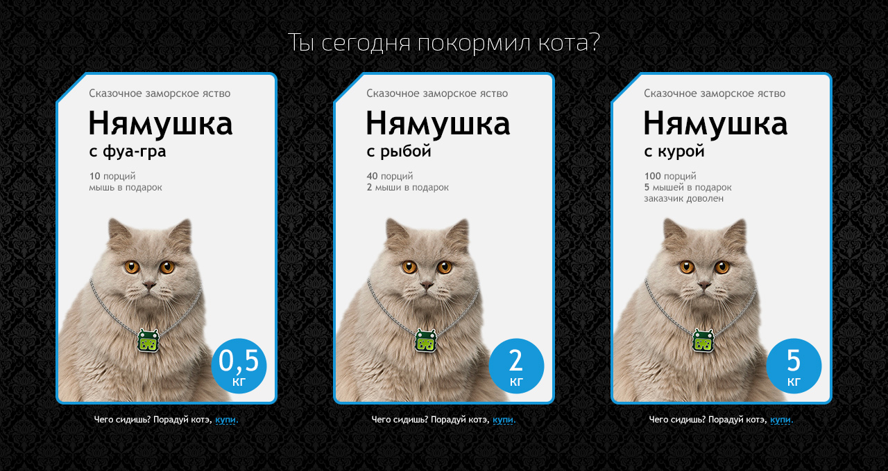

# Тестовое задание для компании «FanBox»

## Описание проекта

[Демо](https://cybersunt.github.io/funbox/public) | [Техническое задание](Specification.md) | [Ответы на вопросы](FAQ.md)

* **Используемые технологии**: HTML5, CSS3, JS(ES5)
* **Сетка:** Резинова
* **Адаптив:** да
* **Автоматизация:** Gulp
* **Фреймворки:** нет

* **HTML технологии:** ванильный HTML, разметка по БЭМ
* **CSS технологии:** ванильный СSS, для создания сеток использован **flexbox**
* **JS модули**: переключение состояний товарной карточки
* **SVG**: нет

* **Доступность**:
    *  все картинки имеют подпись, если вдруг будут недоступны
    *  все интерактивные элеменеты доступны с клавиатуры
