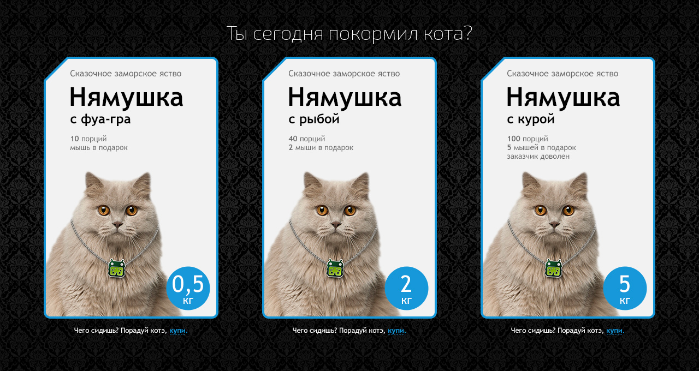

# Задача

Квалификационная задача от Fan-Box.ru

---

## Техническое задание

Внешний вид свёрстанной страницы должен полностью соответствовать макету, а поведение — описанию задачи.

1. Фон занимает всю площадь экрана, блок находится по центру вертикально и горизонтально.
2. Информация о продукте может меняться.
3. Каждая из упаковок может быть выбрана или недоступна для выбора. Выбор осуществляется нажатием на упаковку или на текст «купи» в описании.
4. Можно выбрать одновременно несколько упаковок, а также отменить свой выбор повторным нажатием на упаковку.
5. Состояние наведения применяется к выбранной упаковке не сразу, а после того, как курсор ушел с неё после первоначального выбора.

### Дополненительная задача
Адаптируйте макет под планшеты и смартфоны так, чтобы на планшетах упаковки располагались треугольником, а на смартфонах — друг под другом. Параметры макета при этом можно менять, как того потребует задача.
